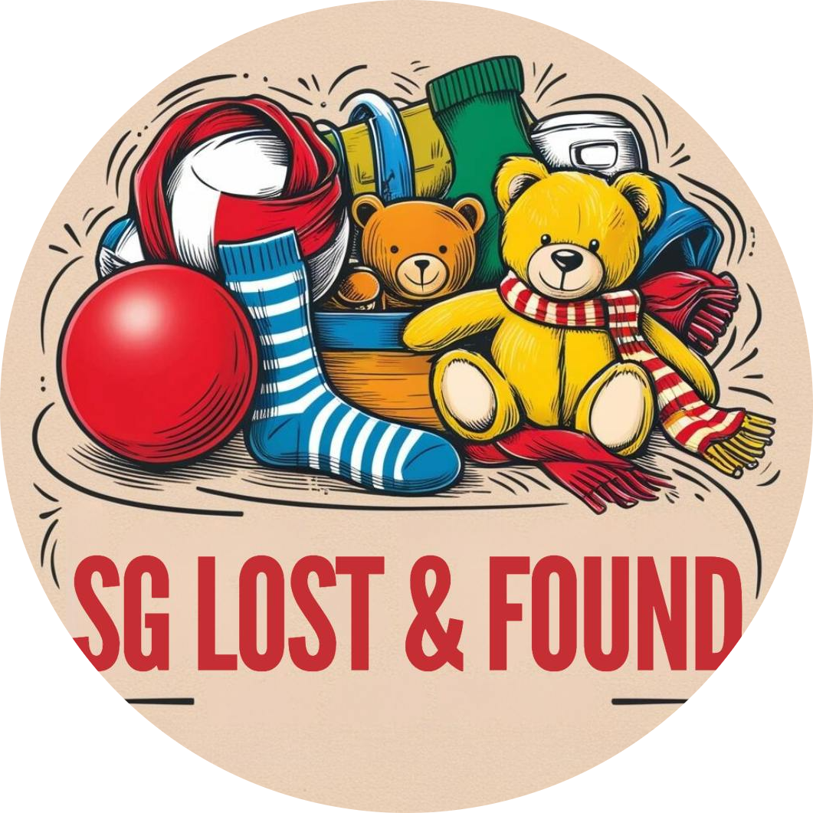

# WAD2 Project SG Lost & Found [G6T5]

<p align="center">
  
  <br>
</p>


* Access our website thorugh this link (https://wad-2-ap5y.vercel.app/)
* Presentation Demo Link: (https://www.canva.com/design/DAGV_FSoNos/cFeEP2WG4CVXrEQi8mSByg/edit?utm_content=DAGV_FSoNos&utm_campaign=designshare&utm_medium=link2&utm_source=sharebutton)


## Table of Contents
- [Team Members](#team-members)
- [Project Overview](#project-overview)
- [Features](#features)
- [Installation Guide](#installation-guide)
  - [Google Firebase Setup](#google-firebase-setup)
    - [Prerequisites](#prerequisites)
    - [Setting Up Firebase in Python (Backend)](#setting-up-firebase-in-python-backend)
    - [Setting Up Firebase in JavaScript (Frontend)](#setting-up-firebase-in-javascript-frontend)
    - [Firebase Configuration (firebaseConfig.js)](#firebase-configuration-firebaseconfigjs)
  - [Dependencies & Firebase Installation](#dependencies--firebase-installation)
  - [Cloud Deployment](#cloud-deployment)
- [Step to Run Codes Locally](#step-to-run-codes-locally)
- [Test User Accounts to Use](#test-user-accounts-to-use)
- [Project Slides & Video](#project-slides--video)
- [Tech Stack](#tech-stack)
  - [Frontend UI](#frontend-ui)
  - [Frontend Framework](#frontend-framework)
  - [Frontend Styling](#frontend-styling)
  - [Backend](#backend)
  - [API](#api)
  - [Beyond the Lab](#beyond-the-lab)


## Team Members
| Name                 | Campus ID | Email Address           |
|----------------------|-----------|--------------------------|
| Hang Zhengyang       | 01493693       | zy.hang.2023@scis.smu.edu.sg       |
| Krysten Wong         | 01490743        | krystenwong.2023@scis.smu.edu.sg       |
| Lee Jia Wen          | 01457374        | jiawen.lee.2022@scis.smu.edu.sg       |
| Quek De Wang         | 01478012        | dewang.quek.2023@scis.smu.edu.sg       |
| Tan Wei Jun Brandon  | 01434864        | brandon.tan.2023@scis.smu.edu.sg       |

## Project Overview
We propose the development of an intuitive web-based application designed to help individuals recover lost items by connecting them with others who have found misplaced belongings. This platform will serve as a virtual community space, where users can easily post about items they’ve lost or found. 

By leveraging user-generated content, the platform will act as a bridge between those who have lost possessions and those who have found them, creating an efficient and collaborative space for reconnecting people with their belongings.

### Features
1. Interactive Map
   - The home page displays a map with location pins of all reported lost and found items. Users can type in the location and the map will zoom into the specific section and display all the reported items in the area. Each item listing is shown in the sidebar. Users can further narrow down the range by filtering categories, status, and dates.

2. Lost and Found Reporting
   - Users can upload images of the item they have found or the item they have lost. They can specify the item name, item type, item description, date and time, location of the item found/lost at, handoff method, and handoff location. Each listing will have a comment section which allows users to post comments and communicate with each other to facilitate collection of the lost items. After the item has been collected by the owner, or call for help is fulfilled, the listing can be marked as completed. There is also a notification system that allows the user to view the comments that they have missed previously.

3. Analytical Dashboard
   - The Analytical Dashboard provides comprehensive insights by tracking the lost items by categry. It also monitors success and failure rates and monthly trends of items found vs lost. It also includes a leaderboard whereby they can view the number of items found by them and the users.

4. User Reward System
   - The User Reward System incentivizes engagement by awarding points for specific actions, such as reporting lost items. Users can redeem accumulated points for various rewards, fostering a sense of accomplishment and loyalty. They can used the points earned to buy borders for their user profile image and backgrounds as well.


## Installation Guide

### Google Firebase Setup
#### Prerequisites
Firebase Project: Ensure you have a Firebase project in the Firebase Console.
Service Account Key: Download the service account JSON file from Project Settings > Service accounts in Firebase Console.

#### Setting Up Firebase in Python (Backend)
```
pip install firebase-admin
```

#### Setting Up Firebase in JavaScript (Frontend)
For frontend Firebase integration, load Firebase from the CDN and configure the Firebase instance using the firebaseConfig.js file.
Dependencies & Firebase Installation

```
<script src="https://www.gstatic.com/firebasejs/9.0.0/firebase-app.js"></script>
<script src="https://www.gstatic.com/firebasejs/9.0.0/firebase-auth.js"></script>
<script src="https://www.gstatic.com/firebasejs/9.0.0/firebase-firestore.js"></script>
<script src="https://www.gstatic.com/firebasejs/9.0.0/firebase-storage.js"></script>

```

#### FIrebase Configuration (firebaseConfig.js)
````
// Firebase Configuration
const firebaseConfig = {
    apiKey: "<YOUR_API_KEY>",
    authDomain: "your-project-id.firebaseapp.com",
    databaseURL: "https://your-project-id.firebaseio.com",
    projectId: "your-project-id",
    storageBucket: "your-project-id.appspot.com",
    messagingSenderId: "your-messaging-sender-id",
    appId: "your-app-id",
    measurementId: "G-your-measurement-id"
};

// Initialize Firebase
const app = firebase.initializeApp(firebaseConfig);
const auth = firebase.auth();
const db = firebase.firestore();
const storage = firebase.storage();

export { app, auth, db, storage };
````

### Dependencies & Firebase Installation

To install the dependencies, run
```
pip install -r requirements.txt
```


### Cloud Deployment

Upload the project to [Vercel](https://vercel.com/), set backend to other and run the deployment.


## Step to Run Codes Locally
```
python app.py
```


## Test User Accounts to Use
| User   | Email           | Password  |
|--------|---------------------|-----------|
| User #1 | prof@gmail.com | Test123456 |
| User #2 | instructor@gmail.com | Test123456 |


## Project Slides & Video
1. [Demo Slides](https://www.canva.com/design/DAGV_FSoNos/cFeEP2WG4CVXrEQi8mSByg/edit?utm_content=DAGV_FSoNos&utm_campaign=designshare&utm_medium=link2&utm_source=sharebutton)  
2. [Demo Video](https://www.youtube.com/watch?v=t9Sk4PU2Vv4) 


## Tech Stack
#### Frontend UI
- [](https://developer.mozilla.org/en-US/docs/Web/Guide/HTML/HTML5)
- [](https://developer.mozilla.org/en-US/docs/Web/JavaScript)
- [](https://developer.mozilla.org/en-US/docs/Web/CSS)
- [](https://www.json.org/)


#### Frontend Framework
- [](https://vuejs.org/)

#### Frontend Styling
- [](https://getbootstrap.com/)

#### Backend
- [](https://firebase.google.com/)
- [](https://www.python.org/)
- [](https://flask.palletsprojects.com/)


#### API
- [](https://developers.google.com/maps)
- [](https://developers.google.com/maps/documentation/distance-matrix)

#### Beyond the Lab
- [](https://www.chartjs.org/) <br><br><br>


[](https://your-link-here.com)


